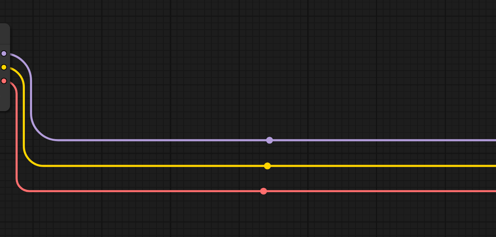

<div align="center">
    
</div><br>


A one-click collection of alternate connection styles for ComfyUI.

------------------------------------------------------------------

<div align="center">
    
</div>

------------------------------------------------------------------

Different types of **link connections** and **geometry awareness**.

<div align="center">
    
    
    
</div>

<div align="center">
    
</div>


## Requirements

**ComfyUI frontend**: ≥ **1.27.1** (new link renderer API)

> On older ComfyUI versions, use ExtraLinks v0.0.2 (see Compatibility).

------------------------------------------------------------------

## Installation

### Git Clone

```powershell
cd ComfyUI\custom_nodes
git clone https://github.com/edoardocarmignani/extralinks.git
```

Restart ComfyUI.

### ComfyUI Manager

Go to **Custom Nodes Manager** and search for **Extra Links**, install and restart ComfyUI.

### Comfy CLI

```powershell
comfy node install extralinks
```

Restart ComfyUI.

------------------------------------------------------------------

## Usage

Open **Settings** → **Extra Links** and configure:

- **Enable**: toggle on/off
- **Shape**: `Curved` | `Manhattan` | `Subway`
- **Radius**: corner smoothing
- **Offset**: horizontal separation for multi-outputs
- **Curvature**: strength of turn-in/out

Changes apply immediately to the canvas.

------------------------------------------------------------------

## Compatibility

| ExtraLinks version | ComfyUI frontend | Notes |
|--------------------|------------------|-------|
| **1.0.0+**         | **≥ 1.27.1**     | Uses new `drawLinkPath` API |
| 0.0.2              | < 1.27.1         | Legacy `renderLink` patch |

> Staying on an older ComfyUI? Keep using **v0.0.2** (see legacy tag/releases).  

------------------------------------------------------------------

## Troubleshooting

- **Only the center dot appears**  
Likely start/end were read as arrays. Ensure you’re on **v1.0.0+**; we read `{x,y}` points.
- **No lines drawn**  
Check DevTools Console for warnings from ExtraLinks; verify ComfyUI is **≥ 1.27.1**.
- **After toggling Enable nothing changes**  
Try reloading the page; ensure there’s no other extension overriding link rendering.

If issues persist, please open an issue with:

- ComfyUI frontend commit/date
- Browser + OS
- A screenshot / brief recording
- Console logs (copy/paste)

👉 [Open an issue](https://github.com/edoardocarmignani/extralinks/issues)

------------------------------------------------------------------

## Versioning & Releases

- **1.1.1** - Fixed collapsed state node links.
- **1.1.0** - Added subway style and geometry awareness.
- **1.0.2** - Fixed path method to patch each instance.
- **1.0.1** - Fixed links lookup.
- **1.0.0** - Migration to new ComfyUI link renderer (**breaking**: drops < 1.27.1).

> See [`CHANGELOG`](CHANGELOG.md) for details.

Tags:

- `v1.x.y` → current series.
- `v0.0.2` → legacy (for older ComfyUI).

------------------------------------------------------------------

## Development

- Main code lives in `extralinks/web/ExtraLinks.js`
- Settings/registration live in `extralinks/web/extralinks_register.js`
- Python exposes `WEB_DIRECTORY` via `extralinks/__init__.py`

Typical flow:

```bash
# edit JS files
# reload ComfyUI browser tab
# watch console for "[Extra Links]" logs
```

Optional Runtime guard:

```javascript
const ok = app?.canvas?.linkRenderer?.pathRenderer?.drawLinkPath;
if (!ok) {
  console.warn("[ExtraLinks] Requires ComfyUI frontend >= 1.27.1");
}
```

------------------------------------------------------------------

## License

MIT (see [`LICENSE`](LICENSE))

------------------------------------------------------------------

## Credits

- Built by [@edoardocarmignani](https://github.com/edoardocarmignani)
- Thanks to the ComfyUI community for the incredible work
